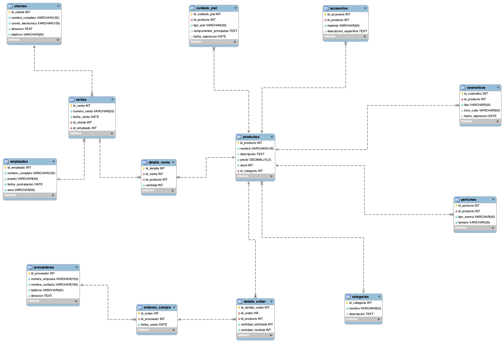

# Base de Datos Tienda de Maquillaje

Proyecto de base de datos relacional para una tienda de maquillaje que gestiona productos, clientes, ventas, empleados y proveedores. Desarrollado como parte del Taller 8 de MySQL.

## Descripción del Proyecto

Este proyecto es una base de datos para gestionar una tienda de maquillaje que vende:

- Cosméticos: Labiales, bases, sombras, rimel, delineadores, etc.
- Cuidado de la piel: Limpiadores, hidratantes, tónicos, mascarillas, serums
- Perfumes: Fragancias con diferentes aromas (floral, cítrico, madera, etc.)
- Accesorios: Pinceles, esponjas, espejos, organizadores, etc.

La base de datos permite:
- Gestionar el inventario de productos con categorías específicas
- Registrar clientes y sus compras
- Controlar ventas y el desempeño de empleados
- Administrar proveedores y órdenes de compra
- Generar reportes y estadísticas de ventas

**Nota personal:** Este proyecto fue desarrollado aplicando los conceptos aprendidos en el curso de MySQL 2, incluyendo normalización, integridad referencial, y procedimientos almacenados para optimizar las consultas.

## Requisitos

- MySQL 8.0 o superior (necesario para las funciones y procedimientos almacenados)
- Cliente MySQL (puede ser mysql command-line, MySQL Workbench, o similar)
- Acceso a un servidor MySQL (local o remoto)

## Estructura del Proyecto

```
Taller_8_MySQL/
├── README.md                          # Documentación del proyecto
├── diagramas/
│   └── diagrama_er.png                # Diagrama entidad-relación
└── sql/
    ├── DDL.sql       # Script de creación de tablas
    ├── DML.sql          # Script de datos de prueba
    └── DQL.sql  # Procedimientos almacenados
```

## Diagrama Entidad-Relación

## Esquema de la Base de Datos

### Tablas Principales

#### 1. categorias
Almacena las categorías de productos.
- `id_categoria` (INT, PK): Identificador único
- `nombre` (VARCHAR(50)): Nombre de la categoría (cosméticos, cuidado de la piel, perfumes, accesorios)
- `descripcion` (TEXT): Descripción opcional

#### 2. productos
Tabla general de productos con información común.
- `id_producto` (INT, PK): Identificador único
- `nombre` (VARCHAR(100)): Nombre del producto
- `descripcion` (TEXT): Descripción detallada
- `precio` (DECIMAL(10,2)): Precio del producto
- `stock` (INT): Cantidad disponible en inventario
- `id_categoria` (INT, FK): Referencia a categorias

#### 3. cosmeticos
Atributos específicos para productos cosméticos.
- `id_cosmetico` (INT, PK): Identificador único
- `id_producto` (INT, FK): Referencia a productos
- `tipo` (VARCHAR(50)): Tipo (labial, base, sombra, etc.)
- `tono_color` (VARCHAR(50)): Tono o color
- `fecha_expiracion` (DATE): Fecha de expiración

#### 4. cuidado_piel
Atributos específicos para productos de cuidado de la piel.
- `id_cuidado_piel` (INT, PK): Identificador único
- `id_producto` (INT, FK): Referencia a productos
- `tipo_piel` (VARCHAR(20)): Tipo de piel (seca, grasa, mixta)
- `componentes_principales` (TEXT): Componentes principales
- `fecha_expiracion` (DATE): Fecha de expiración

#### 5. perfumes
Atributos específicos para perfumes.
- `id_perfume` (INT, PK): Identificador único
- `id_producto` (INT, FK): Referencia a productos
- `tipo_aroma` (VARCHAR(50)): Tipo de aroma
- `tamano` (VARCHAR(20)): Tamaño del envase

#### 6. accesorios
Atributos específicos para accesorios.
- `id_accesorio` (INT, PK): Identificador único
- `id_producto` (INT, FK): Referencia a productos
- `material` (VARCHAR(50)): Material del accesorio
- `descripcion_especifica` (TEXT): Descripción específica

#### 7. clientes
Información de clientes registrados.
- `id_cliente` (INT, PK): Identificador único
- `nombre_completo` (VARCHAR(100)): Nombre completo
- `correo_electronico` (VARCHAR(100)): Correo electrónico (único)
- `direccion` (TEXT): Dirección física
- `telefono` (VARCHAR(20)): Número de teléfono

#### 8. empleados
Información de empleados de la tienda.
- `id_empleado` (INT, PK): Identificador único
- `nombre_completo` (VARCHAR(100)): Nombre completo
- `puesto` (VARCHAR(50)): Puesto de trabajo
- `fecha_contratacion` (DATE): Fecha de contratación
- `area` (VARCHAR(50)): Área de trabajo (venta, bodega, administración)

#### 9. ventas
Registro de ventas realizadas.
- `id_venta` (INT, PK): Identificador único
- `numero_venta` (VARCHAR(20)): Número de venta (único)
- `fecha_venta` (DATE): Fecha de la venta
- `id_cliente` (INT, FK): Referencia a clientes
- `id_empleado` (INT, FK): Referencia a empleados

#### 10. detalle_venta
Detalle de productos en cada venta.
- `id_detalle` (INT, PK): Identificador único
- `id_venta` (INT, FK): Referencia a ventas
- `id_producto` (INT, FK): Referencia a productos
- `cantidad` (INT): Cantidad de productos vendidos

#### 11. proveedores
Información de proveedores.
- `id_proveedor` (INT, PK): Identificador único
- `nombre_empresa` (VARCHAR(100)): Nombre de la empresa
- `nombre_contacto` (VARCHAR(100)): Nombre del contacto
- `telefono` (VARCHAR(20)): Número de teléfono
- `direccion` (TEXT): Dirección física

#### 12. ordenes_compra
Registro de órdenes de compra a proveedores.
- `id_orden` (INT, PK): Identificador único
- `id_proveedor` (INT, FK): Referencia a proveedores
- `fecha_orden` (DATE): Fecha de la orden

#### 13. detalle_orden
Detalle de productos en cada orden de compra.
- `id_detalle_orden` (INT, PK): Identificador único
- `id_orden` (INT, FK): Referencia a ordenes_compra
- `id_producto` (INT, FK): Referencia a productos
- `cantidad_solicitada` (INT): Cantidad solicitada
- `cantidad_recibida` (INT): Cantidad recibida

## Instalación

### Paso 1: Obtener el proyecto

```bash
# Si estás usando git
git clone <URL_DEL_REPOSITORIO>
cd Taller_8_MySQL
```

### Paso 2: Ejecutar el script DDL (Creación de tablas)

```bash
# Usando cliente MySQL desde línea de comandos
mysql -u tu_usuario -p < sql/ddl_creacion_tablas.sql

# O desde dentro de MySQL
mysql -u tu_usuario -p
source sql/ddl_creacion_tablas.sql
```

Este script:
- Crea la base de datos `tienda_maquillaje`
- Crea todas las tablas con sus restricciones
- Establece las relaciones foreign key
- Crea índices para mejorar el rendimiento

### Paso 3: Ejecutar el script DML (Datos de prueba)

```bash
mysql -u tu_usuario -p tienda_maquillaje < sql/dml_datos_prueba.sql

# O desde dentro de MySQL
USE tienda_maquillaje;
source sql/dml_datos_prueba.sql
```

Este script inserta:
- 4 categorías
- 15 clientes
- 15 empleados
- 15 proveedores
- 60 productos (15 por categoría)
- 20 ventas
- 60 detalles de venta
- 15 órdenes de compra
- 45 detalles de orden

### Paso 4: Ejecutar el script DQL (Procedimientos almacenados)

```bash
mysql -u tu_usuario -p tienda_maquillaje < sql/dql_funciones_procedimientos.sql

# O desde dentro de MySQL
USE tienda_maquillaje;
source sql/dql_funciones_procedimientos.sql
```

Este script crea 10 procedimientos almacenados para las consultas requeridas.

## Procedimientos Almacenados

El proyecto incluye 10 procedimientos almacenados para facilitar las consultas más comunes:

### 1. `listar_cosmeticos_por_tipo`
Lista todos los productos de cosméticos de un tipo específico.

```sql
CALL listar_cosmeticos_por_tipo('labial');
```

**Parámetros:**
- `p_tipo` (VARCHAR): Tipo de cosmético (ej: 'labial', 'base', 'sombra')

**Resultado:** Lista de cosméticos con sus atributos específicos.

### 2. `productos_stock_bajo`
Obtiene productos en una categoría con stock inferior a un valor dado.

```sql
CALL productos_stock_bajo('cosméticos', 20);
```

**Parámetros:**
- `p_categoria` (VARCHAR): Categoría de productos
- `p_stock_minimo` (INT): Valor mínimo de stock

**Resultado:** Productos con stock bajo, ordenados por cantidad ascendente.

### 3. `ventas_por_cliente_fechas`
Muestra todas las ventas realizadas por un cliente en un rango de fechas.

```sql
CALL ventas_por_cliente_fechas(1, '2026-01-01', '2026-04-30');
```

**Parámetros:**
- `p_id_cliente` (INT): ID del cliente
- `p_fecha_inicio` (DATE): Fecha inicial del rango
- `p_fecha_fin` (DATE): Fecha final del rango

**Resultado:** Ventas del cliente con productos y totales.

### 4. `total_ventas_empleado_mes`
Calcula el total de ventas realizadas por un empleado en un mes dado.

```sql
CALL total_ventas_empleado_mes(1, 3, 2026);
```

**Parámetros:**
- `p_id_empleado` (INT): ID del empleado
- `p_mes` (INT): Número del mes (1-12)
- `p_anio` (INT): Año

**Resultado:** Estadísticas de ventas del empleado en el mes especificado.

### 5. `productos_mas_vendidos`
Lista los productos más vendidos en un período determinado.

```sql
CALL productos_mas_vendidos('2026-01-01', '2026-06-30');
```

**Parámetros:**
- `p_fecha_inicio` (DATE): Fecha inicial del período
- `p_fecha_fin` (DATE): Fecha final del período

**Resultado:** Productos ordenados por unidades vendidas (descendente).

### 6. `consultar_stock_producto`
Consulta el stock disponible de un producto por nombre o ID.

```sql
CALL consultar_stock_producto('Labial');
CALL consultar_stock_producto('1');
```

**Parámetros:**
- `p_identificador` (VARCHAR): ID o nombre del producto

**Resultado:** Información del producto con estado del stock.

### 7. `ordenes_proveedor_ultimo_ano`
Muestra las órdenes de compra realizadas a un proveedor en el último año.

```sql
CALL ordenes_proveedor_ultimo_ano(1);
```

**Parámetros:**
- `p_id_proveedor` (INT): ID del proveedor

**Resultado:** Órdenes de compra con detalle de productos y cantidades.

### 8. `empleados_mas_un_ano`
Lista los empleados que han trabajado más de un año en la tienda.

```sql
CALL empleados_mas_un_ano();
```

**Parámetros:** No requiere parámetros.

**Resultado:** Empleados con antigüedad mayor a 1 año, con nivel de experiencia.

### 9. `total_vendidos_dia`
Obtiene la cantidad total de productos vendidos en un día específico.

```sql
CALL total_vendidos_dia('2026-03-12');
```

**Parámetros:**
- `p_fecha` (DATE): Fecha a consultar

**Resultado:** Estadísticas completas de ventas del día.

### 10. `ventas_producto_especifico`
Consulta las ventas de un producto específico y cuántas unidades se vendieron.

```sql
CALL ventas_producto_especifico('Labial Matte Rojo');
CALL ventas_producto_especifico('1');
```

**Parámetros:**
- `p_identificador` (VARCHAR): ID o nombre del producto

**Resultado:** Estadísticas de ventas del producto (unidades, ingresos, fechas).

## Consultas Disponibles

El sistema permite ejecutar las siguientes consultas a través de procedimientos almacenados:

1. Listar todos los productos de cosméticos de un tipo específico
2. Obtener todos los productos en una categoría con stock inferior a un valor dado
3. Mostrar todas las ventas realizadas por un cliente específico en un rango de fechas
4. Calcular el total de ventas realizadas por un empleado en un mes dado
5. Listar los productos más vendidos en un período determinado
6. Consultar el stock disponible de un producto por su nombre o identificador
7. Mostrar las órdenes de compra realizadas a un proveedor específico en el último año
8. Listar los empleados que han trabajado más de un año en la tienda
9. Obtener la cantidad total de productos vendidos en un día específico
10. Consultar las ventas de un producto específico y cuántas unidades se vendieron

## Uso

### Conexión a la base de datos

```bash
mysql -u tu_usuario -p tienda_maquillaje
```

### Ejemplo de sesión interactiva

```sql
-- Conectar a la base de datos
USE tienda_maquillaje;

-- Ver todas las tablas
SHOW TABLES;

-- Consultar productos de cosméticos tipo labial
CALL listar_cosmeticos_por_tipo('labial');

-- Ver productos con stock bajo
CALL productos_stock_bajo('cosméticos', 20);

-- Consultar ventas de un cliente
CALL ventas_por_cliente_fechas(1, '2026-01-01', '2026-04-30');

-- Ver productos más vendidos
CALL productos_mas_vendidos('2026-01-01', '2026-06-30');

-- Consultar stock de un producto
CALL consultar_stock_producto('Labial');

-- Ver empleados con más de un año
CALL empleados_mas_un_ano();
```

### Consultas manuales adicionales

```sql
-- Ver todos los productos
SELECT * FROM productos;

-- Ver clientes
SELECT * FROM clientes;

-- Ver ventas recientes
SELECT * FROM ventas ORDER BY fecha_venta DESC LIMIT 10;

-- Ver proveedores
SELECT * FROM proveedores;
```

## Características Técnicas

- Motor de almacenamiento: InnoDB (soporta transacciones y foreign keys)
- Codificación: UTF-8 (utf8mb4_unicode_ci)
- Claves primarias: AUTO_INCREMENT INT
- Integridad referencial: Foreign keys con restricciones
- Índices: Índices optimizados para consultas frecuentes
- Restricciones: CHECK constraints para validar datos
- Procedimientos almacenados: 10 procedimientos para consultas comunes

## Seguridad y Validaciones

- Restricciones CHECK para validar categorías y áreas
- Foreign keys para mantener integridad referencial
- Campos UNIQUE para evitar duplicados (correo_electronico, numero_venta)
- Validación de precios y cantidades (deben ser positivos)
- Validación de stock (no puede ser negativo)

## Autor

- Nombre: Henry Morales